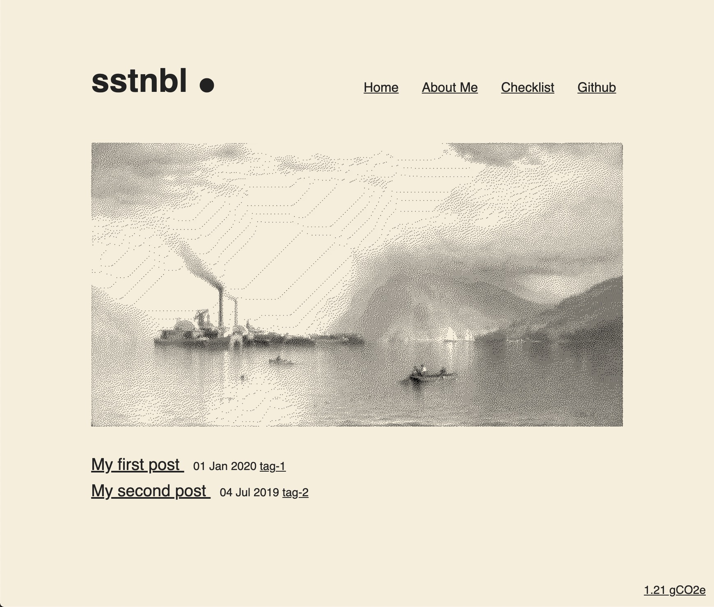

# sstnbl

[WIP] Ultra Lightweight starter for helping build a more sustainable website and reduce its footprint. It's based on [11ty](https://github.com/11ty/eleventy).

Note: It's mainly a low-tech experiment, the goal is to provide just enough code to make a static website working. You need to adjust some things first before launching to production.

## Demo

[](https://sstnbl.bastiencornier.com)

## Getting Started

### 1. Clone this Repository

```
git clone https://github.com/11ty/eleventy-base-blog.git my-website
```

### 2. Navigate to the directory

```
cd my-website
```

Specifically have a look at `.eleventy.js` to see if you want to configure any Eleventy options differently.

### 3. Install dependencies

```
npm install
```

Install eleventy

```
npm i -g eleventy
```

### 4. Edit \_data/metadata.json

### 5. Run Project

build and host locally for local development with watcher

```
npm run start
```

build project

```
npm run build
```

to debug:

```
npm run e11:debug
```

### Sustainable web checklist

- [Checklist](src/sustainable-checklist.md)

### Implementation Notes

- `about/index.md` shows how to add a content page.
- `posts/` has the blog posts but really they can live in any directory. They need only the `post` tag to be added to this collection.
- Add the `nav` tag to add a template to the top level site navigation. For example, this is in use on `index.html` and `about/index.md`.
- Content can be any template format (blog posts needn’t be markdown, for example). Configure your supported templates in `.eleventy.js` -> `templateFormats`.
- Because `css` and `png` are listed in `templateFormats` but are not supported templatez types, any files with these extensions will be copied without modification to the output (while keeping the same directory structure).
- The the feed template is in `feed/feed.njk`. This is also a good example of using a global data files in that it uses `_data/metadata.json`.
- This example uses three layouts:
  - `_includes/layouts/base.html`: the top level HTML structure
  - `_includes/layouts/home.html`: the home page template (wrapped into `base.html`)
  - `_includes/layouts/post.html`: the blog post template (wrapped into `base.html`)
- `_includes/postlist.html` is a Nunjucks include and is a reusable component used to display a list of all the posts. `index.html` has an example of how to use it.

### TODOS

- [x] Add css
- [x] Add js with pwa
- [x] Test feature phone
- [x] Add page size budget management
- [ ] https://web.dev/codelab-adapt-video-to-image-serving-based-on-network-quality/
- [ ] Add html minifier : https://www.11ty.dev/docs/config/#transforms-example-minify-html-output
